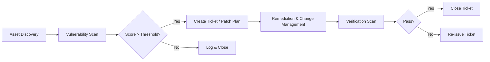

## What is a cybersecurity vulnerability?

A **cybersecurity vulnerability** is any weakness or flaw in a system—software, hardware, network, or process—that an attacker can exploit to gain unauthorized access, cause damage, or steal data.
In practice it means:

1. **Existence of a defect** (e.g., a buffer overflow, mis‑configured permissions, hard‑coded credentials).
2. **Accessibility by an adversary** (the flaw must be reachable through some input or attack vector).
3. **Potential to achieve malicious intent** (gain unauthorized data, execute code, disrupt service).

Vulnerabilities are the _entry points_ attackers use; they are distinct from threats (the attacker’s motivation) and exploits (the method that actually takes advantage of a vulnerability).

## What are the different types of vulnerabilities (software, hardware, network)?

**Vulnerabilities** can be grouped by the layer of the system they affect:

| Layer                           | Typical Vulnerability Types                                                                                                                                                           |
| ------------------------------- | ------------------------------------------------------------------------------------------------------------------------------------------------------------------------------------- |
| **Software (Application / OS)** | • Code bugs (buffer overflows, null‑pointer derefs)<br>• Logic errors (improper input validation, race conditions)<br>• Configuration mistakes (default passwords, weak ACLs)         |
| **Hardware / Firmware**         | • Architectural flaws (Spectre/Meltdown, Foreshadow)<br>• Side‑channel attacks (power analysis, electromagnetic leaks)<br>• Physical tampering / hardware backdoors                   |
| **Network / Protocol**          | • Misconfigured services (open ports, default credentials)<br>• Insecure protocols or cipher suites (TLS 1.0/SSL 3.0)*<br>• Routing or DNS manipulation (BGP hijack, cache poisoning) |

**Key take‑aways**

- **Software** bugs are the most common; they stem from coding or configuration mistakes.
- **Hardware** flaws exploit physical properties of CPUs, GPUs, or IoT chips and can bypass software mitigations.
- **Network** vulnerabilities arise when protocols or service configurations are insecure, enabling eavesdropping, MITM, or unauthorized access.

Understanding which layer a flaw belongs to helps in selecting the right detection tools (static/dynamic analysis for software, firmware scanners for hardware, network packet analyzers / vulnerability scanners for network).

## How do vulnerabilities lead to security breaches in technology-driven organizations?

Vulnerabilities are the _doorways_ that attackers open into a technology‑driven organization.  
When those doorways exist and remain unclosed (unpatched or misconfigured), the attacker can walk in, move around, and pull whatever they want. The typical progression looks like this:

| Stage                                 | What Happens                                                                                                                                                                        | Why It Leads to a Breach                                                                                                       |
| ------------------------------------- | ----------------------------------------------------------------------------------------------------------------------------------------------------------------------------------- | ------------------------------------------------------------------------------------------------------------------------------ |
| **1️⃣ Discovery**                      | Attackers scan the internet for open services, known CVEs, or mis‑configured endpoints (e.g., `http://app.company.com/admin`).                                                      | The scan gives them a “map” of potential entry points.                                                                         |
| **2️⃣ Initial Exploit**                | They target a specific vulnerability—SQLi, RCE, OS command injection, or an unpatched kernel flaw—and send malicious input that the system processes.                               | If the exploit succeeds, they gain code execution, privilege escalation, or data leakage.                                      |
| **3️⃣ Persistence & Lateral Movement** | Once inside, attackers often install back‑doors, create new privileged accounts, or pivot to other systems (via SMB/SMB‑Relay, pass‑the‑hash, or exploiting other vulnerabilities). | Each step expands the attacker’s foothold, turning a single compromised host into an entire network.                           |
| **4️⃣ Data Exfiltration / Impact**     | With enough access they can read confidential files, copy databases, tamper with logs, or launch ransomware.                                                                        | The final outcome is the _breach_: stolen data, service disruption, financial loss, regulatory fines, and reputational damage. |

### Concrete Example

1. **Web app** runs a legacy CMS that has an SQL injection flaw (CVE‑2019‑14790).
2. A hacker sends a crafted request to the site’s search form. The backend executes the injected query and returns the admin password hash.
3. The attacker uses the hash in a brute‑force attack, gains admin rights, creates a new privileged user, and installs a web shell on the server.
4. From that shell they scan the internal network, find an unpatched database server, exploit it (CVE‑2021‑44228), pull customer data, and exfiltrate it to an external IP.

### Why Vulnerabilities Are a Bigger Problem Today

| Factor                      | Impact                                                                                                                  |
| --------------------------- | ----------------------------------------------------------------------------------------------------------------------- |
| **Velocity of Development** | New code is merged daily; patching can lag behind deployment.                                                           |
| **Complex Supply Chains**   | Third‑party libraries bring in hidden CVEs that ripple through your stack.                                              |
| **Cloud & Automation**      | Auto‑scaling and infrastructure as code mean a single misconfigured template can create dozens of vulnerable instances. |
| **Human Element**           | Social engineering or insider misuse often exploits software flaws (e.g., phishing → credential theft → exploitation).  |

### Bottom Line

- **Vulnerabilities are the first rung on the attacker’s ladder.**
- Once exploited, they give attackers footholds that can be leveraged for _persistent_ and _widespread_ compromise.
- Effective patch management, secure coding practices, layered defense, and continuous monitoring are what stop those rungs from being climbed.

## What is the difference between vulnerabilities, threats, and risks?

| Term              | What it means                                                                                                                                      | Example                                                                                                                 |
| ----------------- | -------------------------------------------------------------------------------------------------------------------------------------------------- | ----------------------------------------------------------------------------------------------------------------------- |
| **Vulnerability** | A weakness or flaw in a system that can be exploited. It’s an _internal_ condition of your environment.                                            | A software bug that allows SQL injection, a hard‑coded admin password, or a mis‑configured firewall rule.               |
| **Threat**        | An actor (human, malware, natural event) with intent/ability to exploit a vulnerability. It’s the _outside_ danger.                                | An attacker sending a crafted request, ransomware botnet, or a flood of traffic from a DDoS attack.                     |
| **Risk**          | The potential consequence if a threat exploits a vulnerability – typically expressed as `Probability × Impact`. It’s the _business‑level_ outcome. | “There is a 40 % chance that a SQLi attacker will exploit your unpatched web app, resulting in $500k data‑breach cost.” |

#### How they interact

```
Vulnerability  ──┐
                 │
Threat          │  →  Attack → Exploit → Impact
                 │
              Risk (probability × impact)
```

- **Vulnerabilities** are _necessary_ for an attack but not sufficient by themselves.
- **Threats** bring the _means and motive_ to perform the exploit.
- **Risk** is what you care about from a business perspective – it tells you whether you should patch, harden, or accept the possibility.

#### Quick sanity check

| Scenario                                                                          | Vulnerability? | Threat?                          | Risk?                                                                    |
| --------------------------------------------------------------------------------- | -------------- | -------------------------------- | ------------------------------------------------------------------------ |
| Your server runs an outdated OpenSSL that allows Bleichenbacher attacks.          | Yes            | Any attacker with network access | High if traffic is sensitive, low if only public-facing services use it. |
| A malicious insider has admin rights but you’ve disabled password change via MFA. | No             | Insider actor                    | Medium – risk depends on what data the insider can reach.                |

**Bottom line:**

- **Patch vulnerabilities → reduce the _attack surface_.**
- **Control threats (e.g., limit network exposure, enforce least privilege).**
- **Assess risks to decide where resources should be focused—high‑impact, high‑probability combos deserve immediate action.**

## What are Common Vulnerabilities and Exposures (CVE)?

A publicly‑maintained list that assigns a unique identifier to every known software or hardware vulnerability (or “exposure”). It’s the industry standard for referring to flaws.

### Why CVEs exist

1. **Standardization**
   - Every security researcher, vendor, or product team can refer to the same ID.
2. **Tracking & Communication**
   - Security‑tools (Vulnerability scanners, SIEMs) pull CVE data to flag affected assets.
3. **Prioritization**
   - CVEs are often scored with _CVSS_ (Common Vulnerability Scoring System), giving a quantitative risk metric.

### How it works

| Step           | What happens                                                                                           |
| -------------- | ------------------------------------------------------------------------------------------------------ |
| 1️⃣ Discovery   | A researcher, vendor, or user notices a flaw.                                                          |
| 2️⃣ Reporting   | The issue is reported to the CVE Numbering Authority (CNA) – e.g., NVD, MITRE, or vendor‑specific CNA. |
| 3️⃣ Assignment  | The CNA verifies the flaw and assigns a CVE ID (e.g., `CVE‑2024‑3452`).                                |
| 4️⃣ Publication | Metadata is published in public databases: description, affected products, references, CVSS score.     |
| 5️⃣ Mitigation  | Vendors issue patches; users update; security tools index the new CVE to trigger alerts.               |

### Key components of a CVE record

- **CVE ID** – unique string (`CVE‑YYYY‑NNNN`).
- **Description** – brief summary of the flaw.
- **References** – links to advisories, patches, proofs of concept.
- **CVSS v3.1 score** (base, temporal, environmental).
- **Affected products** – vendor, product name, version range.

### Why you care

| Benefit                   | How it helps                                                                                                |
| ------------------------- | ----------------------------------------------------------------------------------------------------------- |
| **Visibility**            | You can see if your software has known flaws before they are exploited.                                     |
| **Automation**            | Patch‑management tools, CI pipelines, and SIEMs ingest CVE data to trigger updates or alerts automatically. |
| **Risk assessment**       | CVSS scores give a quick risk gauge; you can prioritize patching high‑score vulnerabilities first.          |
| **Regulatory compliance** | Many frameworks (PCI‑DSS, HIPAA) require you to track and remediate known CVEs in the software you control. |

---

### Quick Takeaway

- A **CVE** is simply a _public reference_ for a vulnerability.
- It streamlines communication, tracking, and remediation across vendors, security tools, and organizations.
- Keeping your systems up‑to‑date with patched CVE‑affected components is one of the most effective ways to harden against attacks.

## What is vulnerability management?

_A structured program that identifies, evaluates, and remediates security weaknesses across an organization’s technology stack._

---

### 1️⃣ Core Concept

- **Identify** every flaw (software bugs, mis‑configurations, outdated components).
- **Prioritize** them by risk (CVSS score, business value, exploitability).
- **Remediate** or mitigate through patches, configuration changes, or compensating controls.
- **Validate** that the fix works and hasn’t introduced new issues.
- **Report & iterate** to keep the program continuous.

---

### 2️⃣ Key Components

| Stage                                | What it covers                                                                            |
| ------------------------------------ | ----------------------------------------------------------------------------------------- |
| **Asset Discovery**                  | Inventory of servers, devices, applications, cloud resources, and third‑party components. |
| **Vulnerability Scanning / Testing** | Automated tools (Nessus, Qualys, OpenVAS), manual code reviews, penetration tests.        |
| **Risk Assessment & Prioritization** | CVSS scoring, business impact, exploit likelihood, regulatory relevance.                  |
| **Remediation Planning**             | Patch schedules, change‑management tickets, rollback plans.                               |
| **Verification**                     | Re‑scan or manual validation to confirm fix effectiveness.                                |
| **Reporting & Metrics**              | MTTR (Mean Time To Remediate), compliance dashboards, executive summaries.                |

---

### 3️⃣ Typical Workflow



---

### 4️⃣ Why It Matters

| Benefit                    | How it helps                                                                             |
| -------------------------- | ---------------------------------------------------------------------------------------- |
| **Risk Reduction**         | Systematically closes high‑risk gaps before attackers exploit them.                      |
| **Compliance**             | Meets PCI‑DSS, HIPAA, FedRAMP, ISO 27001 requirements for vulnerability management.      |
| **Cost Savings**           | Early fixes prevent costly breach investigations and remediation.                        |
| **Operational Visibility** | Dashboards show trend of discovered vs. closed vulnerabilities—helps allocate resources. |

---

### 5️⃣ Best Practices

1. **Automate Where Possible** – Continuous integration pipelines, scheduled scans, auto‑ticket creation.
2. **Integrate with Change Management** – Patches should be part of routine releases, not emergency jobs.
3. **Use Contextual Prioritization** – Combine CVSS with business impact (e.g., “a vulnerability in the customer payment gateway is higher priority than one in a legacy reporting tool”).
4. **Validate Remediations** – Never assume a patch fixed the problem; re‑scan or perform penetration tests on critical assets.
5. **Maintain an Asset Inventory** – Vulnerabilities are only as useful as the assets they map to.

---

### 6️⃣ Quick Checklist

- [ ] Comprehensive asset inventory (on‑prem, cloud, third‑party).
- [ ] Regular automated scans (weekly/monthly).
- [ ] CVSS scoring + risk matrix applied consistently.
- [ ] Remediation tickets in an approved workflow.
- [ ] Verification scan or manual review after patch.
- [ ] Monthly report to stakeholders; track MTTR & coverage.

---

### Bottom Line

Vulnerability management is the **operational loop** that turns raw threat intelligence into concrete, prioritized action items—reducing risk, meeting compliance, and protecting business value.

## What is responsible disclosure in the context of vulnerabilities?

**The process of safely informing vendors and the broader community about a newly‑discovered vulnerability so that it can be fixed before it is publicly exploited.**

---

### Why It Matters

- **Prevents premature exploitation:** Giving attackers a “window” to target.
- **Encourages cooperation:** Vendors are more likely to work with researchers if they’re treated fairly.
- **Builds trust in the security community:** Shows that research is constructive, not destructive.

---

## The Core Steps

| Step                                       | What Happens                                                                                                                                                                                      | Key Players                                  |
| ------------------------------------------ | ------------------------------------------------------------------------------------------------------------------------------------------------------------------------------------------------- | -------------------------------------------- |
| **1️⃣ Identify & Verify**                   | Researcher (or internal staff) confirms a real vulnerability (proof‑of‑concept or repeatable exploit).                                                                                            | Vulnerability researcher / security engineer |
| **2️⃣ Secure Evidence**                     | Capture logs, screenshots, and a reproducible workflow. Store evidence securely; avoid leaking raw payloads publicly.                                                                             | Researcher / QA                              |
| **3️⃣ Contact the Vendor**                  | Send a confidential report to the product’s designated “security@” address or use an official CVE Numbering Authority (CNA) portal. Include all details, severity, and a reasonable fix timeline. | Researcher ↔ Vendor / CNA                    |
| **4️⃣ Vendor Assessment & Fix Development** | Vendor validates, assigns a CVE ID, patches the flaw, and tests the fix.                                                                                                                          | Vendor’s security team                       |
| **5️⃣ Coordinated Disclosure**              | Once the vendor confirms a patch and release plan (usually 30–90 days), the researcher publicly announces the vulnerability—often via the vendor’s advisory, mailing list, or a joint statement.  | Researcher & Vendor                          |
| **6️⃣ Follow‑up & Verification**            | Verify that the public release indeed contains the fix; if not, update disclosure and communicate any new timelines.                                                                              | Both parties                                 |

## Role of Bug‑Bounty Platforms

- **Standardized process:** Programs like HackerOne, Bugcrowd, and Synack provide structured forms, escalation tracks, and payout mechanisms.
- **Automatic CVE assignment** (via participating CNAs) reduces friction.
- **Incentivization** encourages broader participation while maintaining responsibility.

---

## When Things Go Wrong

| Scenario                                | Potential Fallout                                                                                                                                                              |
| --------------------------------------- | ------------------------------------------------------------------------------------------------------------------------------------------------------------------------------ |
| **Unresponsiveness by vendor**          | Researchers may need to “public‑disclose” after a reasonable waiting period (often 90 days).                                                                                   |
| **Legal disputes**                      | Some companies file lawsuits for “unauthorized access.” Understanding the _Safe Harbor_ provisions of laws like the Computer Fraud and Abuse Act can help mitigate legal risk. |
| **Patch delay leading to exploitation** | Even with responsible disclosure, if a vendor is slow or ignores the issue, attackers may still exploit it before release. This highlights the need for rapid patch cycles.    |

---

### Bottom Line

Responsible disclosure is the ethical bridge between security researchers and vendors. By following its steps—secure evidence, confidential reporting, coordinated public announcement—you protect users, help keep products safe, and uphold the integrity of the security community.

## What are common tools used for vulnerability scanning?

| Category                    | Tool                    | Key Features                                                                  | Typical Use‑Case                                        |
| --------------------------- | ----------------------- | ----------------------------------------------------------------------------- | ------------------------------------------------------- |
| **Network / Host Scanners** | **Nmap**                | Open‑source port & OS discovery; NSE scripts for service checks.              | Quick inventory, first‑pass security audit.             |
|                             | **OpenVAS (Greenbone)** | Full CVE database, authenticated scans, customizable policies.                | Vulnerability assessment for on‑prem or cloud networks. |
|                             | **Nessus / Tenable.io** | Proprietary scanner with extensive plug‑ins and a huge vulnerability library. | Enterprise‑grade continuous scanning.                   |

---

| Category                     | Tool            | Key Features                                                                 | Typical Use‑Case                                      |
| ---------------------------- | --------------- | ---------------------------------------------------------------------------- | ----------------------------------------------------- |
| **Web Application Scanners** | **OWASP ZAP**   | Open‑source, automated crawling, XSS/SQLi tests, scriptable with Python/JVM. | Manual pentest or CI‑pipeline scanning for web apps.  |
|                              | **Burp Suite ** | Advanced intercepting proxy, active scanner, intruder, repeater.             | Security testing of complex, authenticated sites.     |
|                              | **Nikto**       | Simple HTTP/HTTPS checks for default files, misconfigurations.               | Lightweight quick check on servers before deep scans. |

## Why is vulnerability management essential for a company’s cybersecurity posture?

| #                                   | Benefit                                                                                                     | What It Means for Your Company                                 |
| ----------------------------------- | ----------------------------------------------------------------------------------------------------------- | -------------------------------------------------------------- |
| **1️⃣ Risk Reduction**               | Systematically identifies and fixes weaknesses before attackers can exploit them.                           | Lower chance of data breaches, ransomware, or service outages. |
| **2️⃣ Compliance & Auditing**        | Demonstrates that you’re actively managing known risks (PCI‑DSS, HIPAA, FedRAMP, ISO 27001).                | Fewer audit failures and associated penalties.                 |
| **3️⃣ Cost Efficiency**              | Prioritizes fixes based on risk score → resources are spent where they matter most.                         | Avoids chasing low‑impact bugs that waste engineering time.    |
| **4️⃣ Faster Response to Threats**   | Continuous monitoring catches newly discovered CVEs early, giving you a narrow window for remediation.      | Shortens MTTR (Mean Time To Remediate) and limits exposure.    |
| **5️⃣ Business Continuity**          | Protects critical applications and infrastructure from outages caused by exploited vulnerabilities.         | Maintains service uptime and customer trust.                   |
| **6️⃣ Visibility & Decision‑Making** | Provides dashboards, metrics, and trend data that senior leadership can use to budget security initiatives. | Turns raw findings into actionable business insights.          |
| **7️⃣ Culture of Security**          | Embeds proactive vulnerability scanning into dev pipelines, fostering a “security by design” mindset.       | Reduces human error and promotes secure coding practices.      |

### Bottom Line

A formal Vulnerability Management program turns ad‑hoc scans into _strategic risk control_. It gives you:

- **Predictable protection** against emerging threats.
- **Regulatory confidence** through documented evidence.
- **Operational resilience** by patching the most dangerous weaknesses first.

Without it, your organization is like a house with holes in the walls—leaky and vulnerable. With it, you’re closing those holes before attackers even notice they exist.
